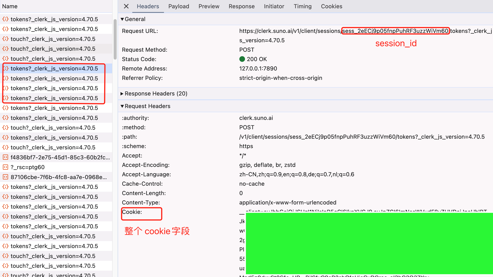
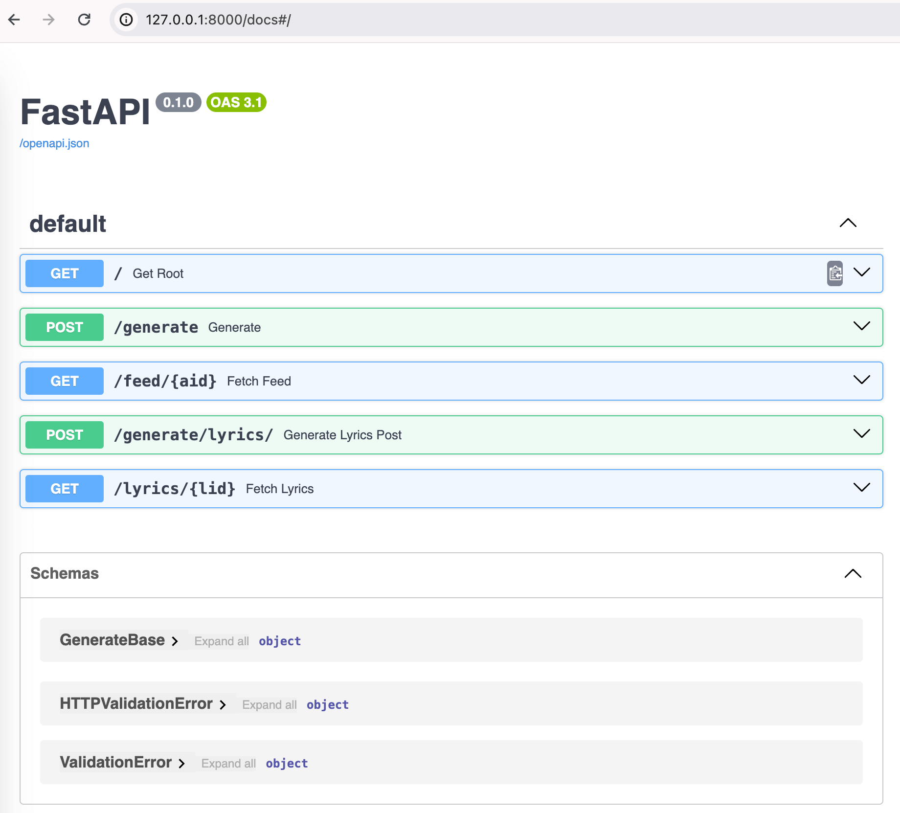

# 非公式 Suno API

Python と FastAPI をベースにした非公式の Suno API です。現在、曲や歌詞などの生成に対応しています。
トークンのメンテナンスと keep-alive 機能が組み込まれているので、トークンの期限切れを心配する必要はありません。

### 特徴

- 自動トークンメンテナンスと keep-alive
- 完全非同期、高速、将来の拡張に対応
- シンプルなコード、メンテナンスが容易、二次開発に便利


### 使用方法

#### 設定

`.env.example` ファイルを編集して `.env` にリネームし、session_id と cookie を記入する。

これらは最初にブラウザから取得され、後で自動的に keep-alive されます。




#### 実行

依存関係をインストールする

```bash
pip3 install -r requirements.txt
```

この部分については、各自で FastAPI ドキュメントを参照してください。
```bash
uvicorn main:app
```

#### Docker

```bash
docker compose build && docker compose up
```

#### ドキュメント

サービスをセットアップしたら、/docs にアクセスしてください




#### 連絡する


